# CORE RIVALS — Documento Técnico de Arquitectura
### Fase 1: Planificación y Diseño

> **Estado:** Pre-implementación | **Versión:** 1.2 | **Fecha:** 2026-06-08  
> **Autores:** Equipo CORE RIVALS — Duman, Moises, Sebastián  
> **v1.1:** Corrección de diseño — GolfClub y Bow rediseñados como entidades del mundo. Añadidos WorldItem, ItemSpawnPoint, ItemPickupSystem, ItemRespawnSystem.  
> **v1.2:** Decisiones de diseño confirmadas — duración, puntuación, self-goal, mapa MVP, flechas, dwell timer del Core.

---

## Índice

1. [Resumen Ejecutivo](#1-resumen-ejecutivo)
2. [Análisis de Assets y Personajes](#2-análisis-de-assets-y-personajes)
3. [Riesgos Técnicos](#3-riesgos-técnicos)
4. [Problemas de Diseño Identificados](#4-problemas-de-diseño-identificados)
5. [Mejoras Propuestas al Gameplay](#5-mejoras-propuestas-al-gameplay)
6. [Decisión de Base de Datos](#6-decisión-de-base-de-datos)
7. [Arquitectura General del Sistema](#7-arquitectura-general-del-sistema)
8. [Arquitectura Cliente-Servidor](#8-arquitectura-cliente-servidor)
9. [Sistema de Networking](#9-sistema-de-networking)
10. [Estructura de Carpetas](#10-estructura-de-carpetas)
11. [Modelo de Datos Principal](#11-modelo-de-datos-principal)
12. [Entidades del Juego](#12-entidades-del-juego)
13. [Diagramas UML](#13-diagramas-uml)
14. [Diagramas de Secuencia](#14-diagramas-de-secuencia)
15. [Escalabilidad](#15-escalabilidad)
16. [Plan de Fases](#16-plan-de-fases)

---

## 1. Resumen Ejecutivo

CORE RIVALS es un videojuego multijugador online 1vs1vs1 que fusiona mecánicas de golf, tiro con arco y combate físico. Tres jugadores compiten simultáneamente desde navegadores independientes conectados por internet o red local. El objetivo es dirigir una esfera hacia los Cores (agujeros) de los rivales, evitando que la esfera entre en el propio Core.

**Stack tecnológico confirmado:**

| Capa | Tecnología | Justificación |
|------|-----------|---------------|
| Frontend | React + JavaScript | SPA reactiva, ecosistema maduro |
| Renderizado 3D | Three.js | Standard de facto para WebGL |
| Física | Rapier (WASM) | Determinístico, alto rendimiento, port WebAssembly |
| Backend | Node.js | Event-loop no bloqueante, ideal para I/O en tiempo real |
| Comunicación | Socket.IO | WebSocket con fallbacks, rooms nativas |
| DB Tiempo Real | Redis | In-memory, pub/sub, TTL para sesiones |
| DB Persistente | PostgreSQL | ACID, relacional, robusto para historial y rankings |

---

## 2. Análisis de Assets y Personajes

### 2.1 Inspección de archivos GLB

| Archivo | Tamaño | Meshes | Nodos | Animaciones | Notas |
|---------|--------|--------|-------|-------------|-------|
| `Duman.glb` | 4.4 MB | 4 | 57 | 1 (`Call_Me_Clean`) | Rig estándar Avaturn |
| `Moises.glb` | 3.3 MB | 5 | 58 | **0** | ⚠️ Sin animaciones |
| `Sebastian.glb` | **13 MB** | 12 | 67 | 1 (`avaturn_animation`) | ⚠️ Muy pesado para browser |

### 2.2 Observaciones técnicas críticas

**Compatibilidad del rig:** Los tres modelos usan el esqueleto estándar de Avaturn con huesos nombrados de forma consistente (`LeftToeBase`, `LeftFoot`, `Head`, etc.). Esto es una ventaja: se puede usar un único banco de animaciones compartido (compatible con Mixamo).

**Problema Moises.glb:** No contiene ninguna animación. Antes de la implementación se deben agregar animaciones de idle, caminar, golpear, agachar y celebrar.

**Problema Sebastian.glb:** 13 MB es excesivo para carga en browser en una partida multijugador. Los otros dos rondan los 3-4 MB. Se debe comprimir (Draco/Meshopt), unificar meshes donde sea posible, o reducir polígonos.

**Recomendación de presupuesto de assets:** Cada personaje debería estar bajo 5 MB comprimido (Draco). Sebastian necesita reducción de geometría o compresión agresiva.

---

## 3. Riesgos Técnicos

### RIESGO 1 — Autoridad de física distribuida ★★★★★ (Crítico)

**Descripción:** Rapier es determinístico, pero solo si todos los clientes y el servidor ejecutan exactamente la misma simulación con los mismos inputs. Un solo frame de diferencia produce divergencia acumulativa. La esfera es el elemento central del juego, por lo que cualquier desincronización es visible y destruye la experiencia.

**Mitigación:** Arquitectura server-authoritative. El servidor ejecuta Rapier como fuente de verdad. Los clientes ejecutan Rapier localmente solo para predicción visual. El servidor reenvía el estado canónico cada tick y los clientes reconcilian.

### RIESGO 2 — Latencia en mecánicas de golf y combate ★★★★☆ (Alto)

**Descripción:** Un golpe de golf mal sincronizado (el servidor recibe el input 80ms tarde) produce resultados diferentes entre lo que el jugador ve y lo que sucede realmente. En combate, el lag afecta percepciones de agarre y bloqueo.

**Mitigación:** Client-side prediction para el jugador local + interpolación para remotos + server reconciliation con rollback limitado.

### RIESGO 3 — Tamaño de Sebastian.glb ★★★★☆ (Alto)

**Descripción:** 13 MB de asset inicial bloquea la carga del juego varios segundos en conexiones lentas. En mobile es potencialmente inaceptable.

**Mitigación:** Aplicar Draco compression (reduce ~70%), lazy loading de assets de personajes ajenos después del spawn inicial, LOD si es necesario.

### RIESGO 4 — Falta de animaciones en Moises ★★★☆☆ (Medio)

**Descripción:** El modelo de Moises no tiene animaciones. Sin ellas no puede moverse de forma fluida en el juego.

**Mitigación:** Retarget de animaciones Mixamo al rig Avaturn (compatible), o crear un pipeline de animación antes de la Fase 2.

### RIESGO 5 — Sincronización de 3 clientes simultáneos ★★★☆☆ (Medio)

**Descripción:** Con 3 jugadores, el servidor debe gestionar inputs de 3 fuentes simultáneamente y emitir estado unificado. En redes heterogéneas (un jugador con 200ms, otro con 20ms), la experiencia puede ser desigual.

**Mitigación:** Jitter buffer por jugador, normalización de timestamps con server time, compensación de lag en detección de colisiones del lado servidor.

### RIESGO 6 — Balance de personajes con diferencias de stats ★★★☆☆ (Medio)

**Descripción:** La especificación dice que diferencias no superarán ~10%. Pero aplicar multiplicadores numéricos sin testeo extensivo puede crear meta-strategies donde un personaje domina.

**Mitigación:** Sistema de stats como configuración JSON externa (no hardcoded), A/B testing por partida, métricas de win rate por personaje en PostgreSQL.

### RIESGO 7 — Complejidad de 3 mecánicas en paralelo ★★☆☆☆ (Bajo-Medio)

**Descripción:** Golf + Arco + Lucha son 3 sistemas de física/interacción independientes que deben coexistir y poder interactuar (ej: una flecha desvía a un jugador que iba a golpear). La interoperabilidad entre sistemas no está completamente definida.

**Mitigación:** Diseño por fases (golf primero, lucha segundo, arco tercero). Interfaces claras entre sistemas desde el inicio.

---

## 4. Problemas de Diseño Identificados

### 4.1 ~~Ambigüedades en el sistema de puntuación~~ ✅ RESUELTO

| Decisión | Valor |
|----------|-------|
| Duración de partida | 8 minutos |
| Condición de victoria | Más puntos al terminar el tiempo |
| Core enemigo puntuado | +1 para cada rival (los dos que no son dueños) |
| Self-goal | -1 para el jugador que lo provocó |
| Validación de Core | La esfera debe permanecer 0.5 segundos dentro del agujero |

El dwell timer de 0.5s resuelve el edge case de la esfera que entra y sale rebotando sin intención real: se necesita que la esfera quede claramente dentro para validar el punto.

### 4.2 ~~Mecánica de arco subdefinida~~ ✅ RESUELTO (parcialmente)

| Decisión | Valor |
|----------|-------|
| Flechas afectan a la esfera | Sí — impulso lateral |
| Flechas afectan a jugadores | Sí — pequeño empuje, sin daño |
| Mecanismos del mapa | No existen en MVP (mapa sin obstáculos) |

Pendiente aún: número de flechas por recarga (queda para balance en Fase 7).

### 4.3 ~~Diseño de mapa no especificado~~ ✅ RESUELTO

Mapa MVP definido. Ver sección 4.5 para el layout completo.

### 4.4 Sistema de combate sin daño pero con consecuencias

"No existe daño" pero existen empujar, bloquear, agarrar, desarmar. Falta definir:
- ¿Cuánto dura un agarre? ¿Cómo se escapa?
- ¿Bloquear tiene cooldown?

### 4.5 Mapa MVP — Diseño confirmado

**Geometría:** Plataforma circular de radio ~20m. Borde con barrera baja (la esfera puede salir del mapa si es golpeada con suficiente potencia, activando ItemRespawnSystem y reponiendo la esfera en el centro).

**Distribución de Cores:** Triángulo equilátero centrado en el mapa. Cada Core a 10m del centro, separados 120° entre sí. Esta simetría garantiza que ningún jugador tiene ventaja posicional.

**Spawn points de items:**
- 2 × GolfClub — posicionados en los puntos medios entre pares de Cores (a 7m del centro, 60°/180°/300° — se usan 2 de las 3 posibles)
- 2 × Bow — posicionados en los puntos opuestos, también equidistantes

**Sin obstáculos en MVP.** Los obstáculos son una feature post-lanzamiento.

```
           Core P1 (0°)
              ●
             / \
           /     \
    Bow  ●         ● Bow
       /               \
Club ●                   ● Club
       \               /
    Core P2 (240°) ● ─ ● Core P3 (120°)
```

### 4.4 Sistema de combate sin daño pero con consecuencias

"No existe daño" pero existen empujar, bloquear, agarrar, desarmar. Falta definir:
- ¿Cuánto dura un agarre? ¿Cómo se escapa?
- ¿Desarmar quita el palo de golf permanentemente o temporalmente?
- ¿Bloquear tiene cooldown?

---

## 5. Mejoras Propuestas al Gameplay

### 5.1 Sistema de "Efecto" en golpes de golf
Añadir tres tipos de efecto aplicable al golpe: **topspin** (la esfera acelera al rebotar), **backspin** (la esfera frena) y **sidespin** (curva lateral). Esto añade profundidad estratégica sin complicar los controles.

### 5.2 Cooldown visual de habilidades
Mostrar en la UI de cada jugador el cooldown de sus habilidades especiales (swing potente, flecha especial, agarre). Aumenta la legibilidad del estado del juego.

### 5.3 "Power Nodes" en el mapa
Puntos del mapa que temporalmente potencian el golpe, la velocidad de flecha o la fuerza de empuje. Añaden dinamismo sin romper el balance de personajes.

### 5.4 Replay de gol
Cuando la esfera entra en un Core, mostrar un slow-motion replay de los últimos 3 segundos desde la perspectiva más dramática. Aumenta la satisfacción y el engagement.

### 5.5 Animaciones de personaje reactivas
Aprovechar el rig humanoid completo para animar reacciones: el dueño del Core hace gesto de frustración cuando la esfera entra en su agujero; el que anotó celebra.

---

## 6. Decisión de Base de Datos

### Por qué dos bases de datos

Un juego multijugador en tiempo real tiene dos tipos de datos con naturalezas radicalmente diferentes:

**Datos efímeros (estado de partida):** cambian 60 veces por segundo, tienen TTL natural (fin de partida), necesitan acceso sub-milisegundo, no necesitan durabilidad ACID. → **Redis**

**Datos persistentes (usuarios, historial, rankings):** cambian raramente, necesitan integridad referencial, necesitan queries complejas (JOIN para rankings), necesitan backups. → **PostgreSQL**

### Redis — justificación

- Almacena el estado completo de cada partida como hash serializado
- Pub/Sub para broadcasting entre workers si se escala horizontalmente
- TTL automático limpia datos de partidas terminadas
- Latencia < 1ms en operaciones simples
- Alternativa descartada: Memcached (no tiene pub/sub, menos estructura)

### PostgreSQL — justificación

- Tablas: `users`, `matches`, `match_players`, `scores`, `character_stats`
- ACID garantiza que el historial de partidas es confiable
- Permite queries como "top 10 jugadores con Duman en los últimos 30 días"
- Alternativa descartada: MongoDB (no necesitamos flexibilidad de esquema, sí integridad)
- Alternativa descartada: MySQL (PostgreSQL tiene mejor soporte de JSON y extensiones)

---

## 7. Arquitectura General del Sistema

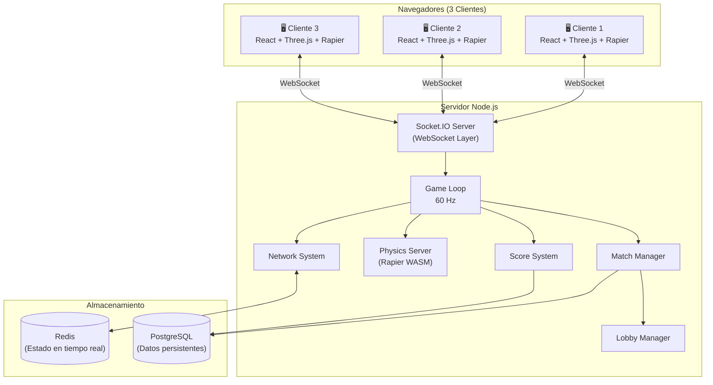

---

## 8. Arquitectura Cliente-Servidor

### 8.1 Principio fundamental: Server-Authoritative

El servidor es la única fuente de verdad. Los clientes nunca deciden el estado del juego, solo envían inputs y reciben estado.

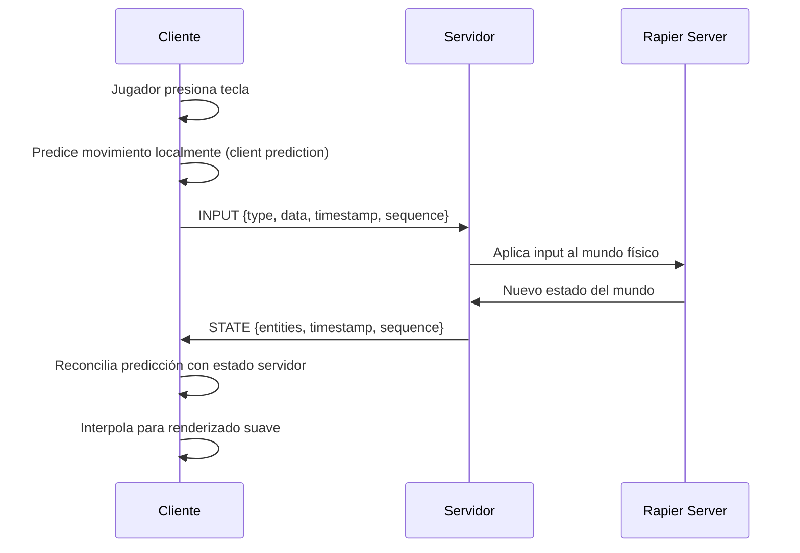

### 8.2 Capas del cliente

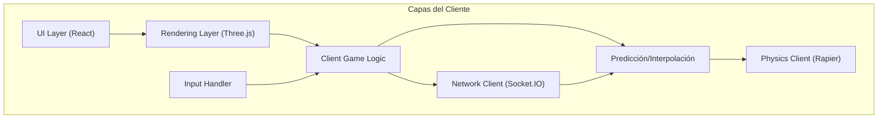

### 8.3 Capas del servidor

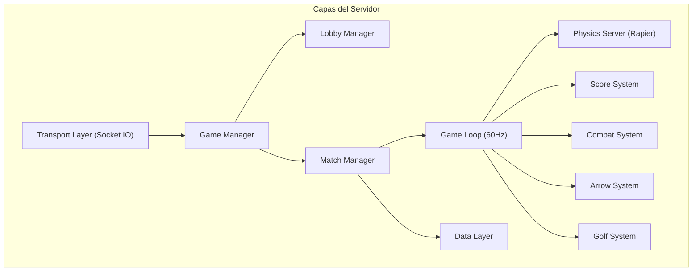

### 8.4 Protocolo de mensajes Socket.IO

| Evento (C→S) | Payload | Descripción |
|-------------|---------|-------------|
| `lobby:create` | `{playerName, character}` | Crear sala |
| `lobby:join` | `{roomId, playerName, character}` | Unirse a sala |
| `lobby:ready` | `{playerId}` | Jugador listo |
| `game:input` | `{type, data, seq, ts}` | Input de jugador |
| `game:swing` | `{power, angle, effect, seq}` | Golpe de golf |
| `game:shoot` | `{direction, strength, seq}` | Disparar flecha |
| `game:combat` | `{action, targetId, seq}` | Acción de combate |
| `game:pickup` | `{itemId, seq, ts}` | Recoger item del suelo |
| `game:drop` | `{seq, ts}` | Soltar item equipado |
| `game:steal` | `{targetId, seq, ts}` | Intentar robar item a otro jugador |

| Evento (S→C) | Payload | Descripción |
|-------------|---------|-------------|
| `lobby:state` | `{players[], status}` | Estado del lobby |
| `match:start` | `{matchId, players[], map, items[]}` | Inicio de partida (incluye posición inicial de items) |
| `match:state` | `{entities, scores, items[], ts, seq}` | Estado del mundo |
| `match:event` | `{type, data}` | Evento relevante (gol, pickup, etc.) |
| `match:item_picked` | `{itemId, playerId, ts}` | Item recogido por un jugador |
| `match:item_dropped` | `{itemId, position, ts}` | Item soltado/perdido en el mapa |
| `match:item_spawned` | `{itemId, type, position, ts}` | Item reaparece en su spawn point |
| `match:end` | `{scores, winner?, stats}` | Fin de partida |

---

## 9. Sistema de Networking

### 9.1 Tick Rate y sincronización

- **Server tick rate:** 60 Hz (16.67ms por tick)
- **Broadcast rate al cliente:** 20 Hz (50ms) — se interpola visualmente a 60fps
- **Input buffer:** 8 frames de inputs almacenados para rollback
- **Max lag aceptable sin degradación visible:** 150ms RTT
- **Timeout de jugador desconectado:** 10 segundos (el partido puede continuar con 2)

### 9.2 Flujo de sincronización de estado

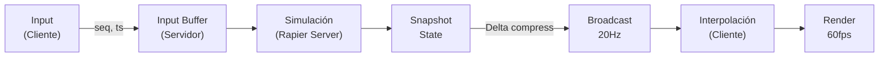

### 9.3 Compensación de lag para combate

Para acciones de combate (empujar, agarrar), el servidor aplica **lag compensation**: guarda snapshots de los últimos 200ms de estado del mundo. Cuando recibe un input de combate tardío, rebobina el estado al timestamp del cliente y valida la acción en ese contexto, evitando que el lag produzca combates injustos.

### 9.4 Manejo de reconexión

Si un jugador se desconecta durante la partida:
1. El servidor congela los inputs de ese jugador (personaje queda en último estado)
2. Espera hasta 10 segundos para reconexión
3. Si reconecta: recibe el estado completo actual y resincroniza
4. Si no reconecta: el partido continúa con 2 jugadores, el Core del ausente queda "neutral" (no otorga puntos)

---

## 10. Estructura de Carpetas

```
core-rivals/
├── client/                          # Aplicación React (browser)
│   ├── public/
│   │   └── assets/
│   │       ├── models/              # .glb comprimidos con Draco
│   │       │   ├── Duman.glb
│   │       │   ├── Moises.glb
│   │       │   └── Sebastian.glb
│   │       ├── animations/          # Banco compartido de animaciones
│   │       │   ├── idle.glb
│   │       │   ├── walk.glb
│   │       │   ├── swing.glb
│   │       │   ├── shoot.glb
│   │       │   └── celebrate.glb
│   │       ├── textures/
│   │       └── sounds/
│   ├── src/
│   │   ├── app/                     # Punto de entrada React
│   │   │   ├── App.jsx
│   │   │   └── Router.jsx
│   │   ├── features/                # Feature modules (Clean Architecture)
│   │   │   ├── lobby/
│   │   │   │   ├── components/
│   │   │   │   ├── hooks/
│   │   │   │   └── store/
│   │   │   ├── match/
│   │   │   │   ├── components/
│   │   │   │   ├── hooks/
│   │   │   │   └── store/
│   │   │   └── hud/
│   │   │       └── components/
│   │   ├── game/                    # Motor del juego (cliente)
│   │   │   ├── core/
│   │   │   │   ├── GameEngine.js
│   │   │   │   ├── GameLoop.js
│   │   │   │   └── EventBus.js
│   │   │   ├── entities/            # Entidades del juego
│   │   │   │   ├── Player.js
│   │   │   │   ├── Sphere.js
│   │   │   │   ├── Core.js
│   │   │   │   ├── WorldItem.js         # Base: item físico del mundo
│   │   │   │   ├── GolfClub.js          # extends WorldItem
│   │   │   │   ├── Bow.js               # extends WorldItem
│   │   │   │   ├── Arrow.js
│   │   │   │   └── ItemSpawnPoint.js    # Punto de spawn de items
│   │   │   ├── systems/             # Sistemas ECS
│   │   │   │   ├── PhysicsSystem.js
│   │   │   │   ├── RenderSystem.js
│   │   │   │   ├── InputSystem.js
│   │   │   │   ├── AnimationSystem.js
│   │   │   │   ├── CombatSystem.js
│   │   │   │   ├── GolfSystem.js
│   │   │   │   ├── ArrowSystem.js
│   │   │   │   ├── ItemPickupSystem.js  # Recogida, drop, robo, desarme
│   │   │   │   └── ItemRespawnSystem.js # Reaparición de items en el mapa
│   │   │   ├── rendering/
│   │   │   │   ├── SceneManager.js
│   │   │   │   ├── CameraController.js
│   │   │   │   ├── CharacterRenderer.js
│   │   │   │   └── EffectsManager.js
│   │   │   ├── network/
│   │   │   │   ├── NetworkClient.js
│   │   │   │   ├── StateInterpolator.js
│   │   │   │   └── ClientPrediction.js
│   │   │   └── physics/
│   │   │       ├── PhysicsWorld.js
│   │   │       └── CollisionHandler.js
│   │   ├── shared/                  # Código compartido con server
│   │   │   ├── constants/
│   │   │   │   ├── GameConstants.js
│   │   │   │   └── SocketEvents.js
│   │   │   ├── types/
│   │   │   │   └── GameTypes.js
│   │   │   └── utils/
│   │   │       ├── MathUtils.js
│   │   │       └── VectorUtils.js
│   │   └── infrastructure/
│   │       └── socket/
│   │           └── SocketClient.js
│   ├── package.json
│   └── vite.config.js
│
├── server/                          # Servidor Node.js
│   ├── src/
│   │   ├── app.js                   # Entry point
│   │   ├── config/
│   │   │   ├── database.js
│   │   │   ├── redis.js
│   │   │   └── server.js
│   │   ├── domain/                  # Clean Architecture - Domain layer
│   │   │   ├── entities/
│   │   │   │   ├── Match.js
│   │   │   │   ├── Player.js
│   │   │   │   ├── Sphere.js
│   │   │   │   ├── Core.js
│   │   │   │   └── Score.js
│   │   │   └── repositories/        # Interfaces (abstracciones)
│   │   │       ├── IMatchRepository.js
│   │   │       └── IPlayerRepository.js
│   │   ├── application/             # Use cases
│   │   │   ├── lobby/
│   │   │   │   ├── CreateLobby.js
│   │   │   │   ├── JoinLobby.js
│   │   │   │   └── StartMatch.js
│   │   │   └── match/
│   │   │       ├── ProcessInput.js
│   │   │       ├── UpdateGameState.js
│   │   │       └── EndMatch.js
│   │   ├── infrastructure/          # Implementaciones concretas
│   │   │   ├── database/
│   │   │   │   ├── PostgresMatchRepository.js
│   │   │   │   └── PostgresPlayerRepository.js
│   │   │   ├── cache/
│   │   │   │   └── RedisGameStateRepository.js
│   │   │   └── socket/
│   │   │       ├── SocketServer.js
│   │   │       ├── LobbyHandler.js
│   │   │       └── MatchHandler.js
│   │   └── game/                    # Motor del juego (servidor)
│   │       ├── GameManager.js
│   │       ├── LobbyManager.js
│   │       ├── MatchManager.js
│   │       ├── GameLoop.js
│   │       ├── systems/
│   │       │   ├── PhysicsSystem.js
│   │       │   ├── ScoreSystem.js
│   │       │   ├── CombatSystem.js
│   │       │   ├── GolfSystem.js
│   │       │   ├── ArrowSystem.js
│   │       │   ├── ItemPickupSystem.js  # Autoridad de pickup/drop/robo
│   │       │   └── ItemRespawnSystem.js # Timers de respawn
│   │       └── physics/
│   │           └── RapierWorld.js
│   ├── migrations/                  # SQL migrations
│   │   ├── 001_create_users.sql
│   │   ├── 002_create_matches.sql
│   │   └── 003_create_scores.sql
│   └── package.json
│
├── shared/                          # Código compartido (symlink o monorepo)
│   ├── constants/
│   │   ├── GameConstants.js         # TICK_RATE, MAX_PLAYERS, etc.
│   │   └── SocketEvents.js          # Nombres de eventos Socket.IO
│   └── types/
│       └── GameTypes.js
│
├── docs/                            # Documentación técnica
│   ├── ARQUITECTURA_FASE1.md        # Este documento
│   └── diagramas/
│
├── docker-compose.yml               # Redis + PostgreSQL para desarrollo
└── README.md
```

---

## 11. Modelo de Datos Principal

### 11.0 Constantes de juego confirmadas (GameConstants.js)

```js
// Partida
MATCH_DURATION       = 480          // segundos (8 minutos)
TICK_RATE            = 60           // Hz servidor
BROADCAST_RATE       = 20           // Hz hacia clientes
MAX_PLAYERS          = 3

// Puntuación
POINTS_PER_CORE      = 1            // puntos que recibe CADA rival cuando entra la esfera
SELF_GOAL_PENALTY    = -1           // penalización al autor del self-goal
CORE_DWELL_TIME      = 0.5          // segundos que la esfera debe permanecer en el Core

// Items
PICKUP_RADIUS        = 1.2          // metros para recoger un item del suelo
DISARM_RADIUS        = 1.0          // metros para desarmar
ITEM_RESPAWN_DELAY   = 20           // segundos hasta que un item reaparece en su spawn point

// Física
GRAVITY              = -9.81        // m/s²
SPHERE_MASS          = 0.046        // kg
SPHERE_RADIUS        = 0.0214       // m
SPHERE_RESTITUTION   = 0.68
SPHERE_FRICTION      = 0.35

// Arco
ARROW_MASS           = 0.025        // kg
ARROW_MIN_SPEED      = 15           // m/s (draw mínimo)
ARROW_MAX_SPEED      = 35           // m/s (draw máximo)
ARROW_LIFETIME       = 8            // segundos
ARROW_PLAYER_IMPULSE = 0.3          // factor de empuje sobre jugadores
ARROW_MAX_IN_AIR     = 3            // flechas simultáneas por portador del arco

// Combate
PUSH_FORCE_BASE      = 8            // Newtons base antes de aplicar stat
GRAB_DURATION        = 2.0          // segundos de inmovilización
BLOCK_COOLDOWN       = 3.0          // segundos
DISARM_COOLDOWN      = 2.0          // segundos tras desarmar

// Mapa
MAP_RADIUS           = 20           // metros (plataforma circular)
CORE_DISTANCE        = 10           // metros del centro a cada Core
ITEM_SPAWN_DISTANCE  = 7            // metros del centro a los spawn points de items
```

### 11.1 PostgreSQL — Tablas relacionales

```sql
-- Usuarios del juego
users (
  id          UUID PRIMARY KEY,
  username    VARCHAR(50) UNIQUE NOT NULL,
  email       VARCHAR(255) UNIQUE,
  created_at  TIMESTAMP DEFAULT NOW()
)

-- Historial de partidas
matches (
  id           UUID PRIMARY KEY,
  status       ENUM('waiting','active','finished'),
  map          VARCHAR(50),
  duration_ms  INTEGER,
  started_at   TIMESTAMP,
  ended_at     TIMESTAMP
)

-- Jugadores por partida
match_players (
  id           UUID PRIMARY KEY,
  match_id     UUID REFERENCES matches(id),
  user_id      UUID REFERENCES users(id),
  character    ENUM('duman','moises','sebastian'),
  score        INTEGER DEFAULT 0,
  placement    SMALLINT,         -- 1, 2 o 3
  connected    BOOLEAN DEFAULT TRUE
)

-- Eventos de puntuación
score_events (
  id            UUID PRIMARY KEY,
  match_id      UUID REFERENCES matches(id),
  core_owner_id UUID REFERENCES match_players(id),  -- dueño del Core donde entró la esfera
  scorer_ids    UUID[],          -- jugadores que reciben +1 (ambos rivales)
  is_self_goal  BOOLEAN DEFAULT FALSE,              -- true si el dueño metió la esfera en su propio Core
  self_goal_player_id UUID REFERENCES match_players(id), -- quién provocó el self-goal
  points        INTEGER,         -- +1 para rivales, -1 para self-goal
  timestamp_ms  INTEGER,         -- ms desde inicio de partida
  recorded_at   TIMESTAMP DEFAULT NOW()
)

-- Stats de personajes (ajuste de balance)
character_stats (
  character     ENUM('duman','moises','sebastian') PRIMARY KEY,
  swing_power   FLOAT DEFAULT 1.0,
  arrow_speed   FLOAT DEFAULT 1.0,
  push_force    FLOAT DEFAULT 1.0,
  grip_strength FLOAT DEFAULT 1.0,
  agility       FLOAT DEFAULT 1.0,
  updated_at    TIMESTAMP DEFAULT NOW()
)
```

### 11.2 Redis — Estado en tiempo real

```
# Sala de lobby
lobby:{roomId}  →  HASH {
  hostId, status, map, createdAt,
  player1Id, player1Name, player1Character, player1Ready,
  player2Id, player2Name, player2Character, player2Ready,
  player3Id, player3Name, player3Character, player3Ready
}  TTL: 1 hora

# Estado del juego en tiempo real
match:{matchId}:state  →  HASH {
  tick, timestamp,
  time_remaining,                          # segundos restantes (cuenta atrás desde 480)
  sphere_x, sphere_y, sphere_z,
  sphere_vx, sphere_vy, sphere_vz,
  sphere_in_core,                          # "none" | "core_p1" | "core_p2" | "core_p3"
  sphere_dwell_timer,                      # segundos que lleva dentro del Core actual (0.0 - 0.5)
  p1_x, p1_y, p1_z, p1_rotY, p1_item,    # p1_item: itemId | "none"
  p2_x, p2_y, p2_z, p2_rotY, p2_item,
  p3_x, p3_y, p3_z, p3_rotY, p3_item,
  score_p1, score_p2, score_p3
}  TTL: 4 horas

# Estado de items del mundo (cada item como hash propio)
match:{matchId}:item:{itemId}  →  HASH {
  id, type,            # GOLF_CLUB | BOW
  state,               # SPAWNED | HELD | RESPAWNING
  pos_x, pos_y, pos_z, # posición en el mapa (si SPAWNED)
  holderId,            # playerId (si HELD) | "none"
  spawnPointId,        # id del spawn point de origen
  respawnAt            # timestamp Unix (si RESPAWNING)
}  TTL: 4 horas

# Input buffer por jugador
match:{matchId}:inputs:{playerId}  →  LIST (FIFO, max 16 items)

# Snapshots para lag compensation (últimos 12 ticks = 200ms)
match:{matchId}:snapshots  →  LIST (12 items, JSON comprimido)
```

---

## 12. Entidades del Juego

### 12.1 Player

Representa a un jugador activo en la partida. **Los jugadores no comienzan con ningún item equipado.** El slot de equipamiento es opcional: un jugador puede estar desarmado en cualquier momento.

**Slot de equipamiento — diseño de una ranura:**
Un jugador puede portar **un único item** a la vez (GolfClub O Bow, nunca ambos). Esta restricción es intencional: crea decisiones estratégicas ("¿suelto el palo para ir a buscar el arco?") y hace que el desarme y el robo sean consecuencias reales.

**Responsabilidades:**
- Mantener posición y rotación sincronizadas con el servidor
- Aplicar las stats del personaje a las acciones con el item equipado
- Gestionar el cooldown de acciones de combate
- Solicitar al ItemPickupSystem el pickup/drop/robo de items
- Notificar al NetworkSystem los inputs

**Stats derivados del personaje (±10% del baseline):**

| Stat | Duman | Moises | Sebastián |
|------|-------|--------|-----------|
| Swing Power | 1.05 | 1.00 | 0.97 |
| Arrow Speed | 0.95 | 1.02 | 1.05 |
| Push Force | 1.08 | 0.95 | 0.97 |
| Grip Strength | 0.92 | 1.00 | 1.05 |
| Agility | 0.95 | 1.00 | 1.03 |

**Nota sobre Grip Strength:** Esta stat actúa como resistencia al desarme y al robo. Un jugador con Grip Strength alto tiene mayor probabilidad de retener su item cuando es desarmado o robado.

### 12.2 WorldItem *(nueva entidad)*

Clase base para todos los objetos físicos del mapa que pueden ser recogidos, soltados, robados o desarmados. GolfClub y Bow son instancias concretas de WorldItem.

**Un WorldItem existe siempre en el mundo** — cuando alguien lo lleva, su posición es la de la mano del portador; cuando está en el suelo, tiene posición y física propias; cuando está en respawn, no existe físicamente pero el sistema contabiliza el timer.

**Ciclo de vida:**
```
SPAWNED (en el suelo) → HELD (portado) → SPAWNED (soltado/desarmado)
                                        → RESPAWNING (cayó fuera del mapa)
RESPAWNING → SPAWNED (timer completado, reaparece en spawn point)
```

**Propiedades:**
- `id`: identificador único
- `type`: `GOLF_CLUB` | `BOW`
- `state`: `SPAWNED` | `HELD` | `RESPAWNING`
- `position`: Vector3 (posición en el mundo cuando SPAWNED)
- `rotation`: Quaternion
- `holderId`: String | null (playerId si está HELD)
- `spawnPointId`: String (spawn point de origen para respawn)
- `physicsEnabled`: Boolean (activo solo cuando SPAWNED y en suelo)

### 12.3 ItemSpawnPoint *(nueva entidad)*

Define una posición fija del mapa donde un WorldItem aparece al inicio de la partida y reaparece tras ser soltado o perdido.

**Propiedades:**
- `id`: identificador único
- `position`: Vector3 (posición fija en el mapa)
- `itemType`: `GOLF_CLUB` | `BOW`
- `respawnDelay`: Float (segundos hasta reaparecer, por defecto 20s)
- `currentItemId`: String | null (el item actualmente asignado a este punto)

**Decisión de diseño sobre número y posición de spawn points:** A definir cuando se diseñe el mapa. Propuesta inicial: 2 palos de golf y 2 arcos distribuidos simétricamente, ninguno adyacente a ningún Core.

### 12.4 GolfClub *(ahora extiende WorldItem)*

Item físico del mapa. Cuando es portado por un jugador, habilita la mecánica de swing. **No está asignado a ningún jugador por defecto.**

**Propiedades adicionales sobre WorldItem:**
- `isSwinging`: Boolean
- `swingCooldown`: Float

**Parámetros de golpe:**
- Potencia: 0-100% (normalizado)
- Ángulo vertical: -15° a +45°
- Ángulo horizontal: -45° a +45° (aim)
- Efecto: `NONE` | `TOPSPIN` | `BACKSPIN` | `SIDESPIN_L` | `SIDESPIN_R`
- Cooldown entre golpes: 1.5s (base, antes de aplicar stats)

**Colisionador en suelo:** cuando está SPAWNED, tiene un collider de sensor de proximidad de radio 1.2m que el servidor usa para detectar si un jugador está cerca y puede recogerlo.

### 12.5 Bow *(ahora extiende WorldItem)*

Item físico del mapa. Cuando es portado, habilita la mecánica de disparo de flechas. **No está asignado a ningún jugador por defecto.**

**Propiedades adicionales sobre WorldItem:**
- `currentDrawStrength`: Float (0.0 → 1.0)
- `isDrawing`: Boolean
- `drawStartTime`: Number

**Restricciones:**
- Máximo de flechas simultáneas en el aire por portador: 3
- Cooldown entre disparos: 2.5s
- Draw time mínimo: 0.3s (tap dispara flecha débil)
- Draw time máximo: 2.0s (potencia máxima)

**Colisionador en suelo:** ídem GolfClub, sensor de proximidad de 1.2m de radio.

### 12.6 ItemPickupSystem *(nuevo sistema)*

Sistema del servidor que gestiona todas las interacciones entre jugadores e items del mundo. Es la autoridad única sobre quién porta qué y cuándo.

**Acciones que procesa:**

`PICKUP` — Jugador recoge item del suelo:
- Valida que el jugador esté dentro del radio de pickup (≤ 1.2m del item)
- Valida que el item esté en estado SPAWNED
- Valida que el jugador no tenga ya un item (slot único)
- Si válido: item pasa a HELD, holderId = playerId, item desaparece del suelo
- Emite `match:item_picked` a todos los clientes

`DROP` — Jugador suelta voluntariamente su item:
- Valida que el jugador tenga un item equipado
- Item cae al suelo en la posición actual del jugador con velocidad heredada
- Estado → SPAWNED, holderId → null, física del item reactivada
- Emite `match:item_dropped`

`DISARM` — Acción de combate que fuerza el drop del item del target:
- Requiere proximidad ≤ 1m (validado con lag compensation)
- El target opone resistencia con su Grip Strength stat
- Si tiene éxito: el item cae al suelo cerca del target, con un pequeño impulso aleatorio
- Si falla (Grip Strength supera threshold): feedback visual de "resistido"
- Cooldown del atacante tras DISARM: 2s

`STEAL` — Intento de tomar el item de un jugador con GRAB previo:
- Solo válido si el atacante está en estado GRAB activo sobre el target
- El target opone resistencia con Grip Strength
- Si tiene éxito: el item pasa directamente al slot del atacante (si está libre)
- Si el atacante ya tiene item: el robo falla (necesita tener slot vacío)

### 12.7 ItemRespawnSystem *(nuevo sistema)*

Gestiona los timers de reaparición de items. Opera exclusivamente en el servidor.

**Responsabilidades:**
- Cuando un item entra en estado RESPAWNING (cayó fuera del mapa, o se indica explícitamente), registra `respawnAt = now + spawnPoint.respawnDelay`
- En cada tick, comprueba si algún item en RESPAWNING ha superado su `respawnAt`
- Cuando el timer expira: item reaparece en su ItemSpawnPoint, estado → SPAWNED, física activada
- Emite `match:item_spawned` a todos los clientes con la posición del spawn point

**Casos que disparan RESPAWNING:**
- El item cae fuera de los límites del mapa (bounding box)
- Queda atrapado en geometría durante más de 5 segundos (stale detection)

**Casos que NO disparan RESPAWNING** (el item queda SPAWNED en el suelo):
- DROP voluntario del jugador
- DISARM exitoso
- Fin de un GRAB

### 12.7b Arrow *(entidad de proyectil)*

Proyectil físico con trayectoria balística generado por el Bow. No causa daño. Al impactar aplica un pequeño impulso sobre su objetivo.

**Comportamiento por tipo de colisión:**

| Objetivo | Efecto |
|----------|--------|
| Esfera | Impulso lateral: `arrow_velocity * 0.3 * arrow_speed_stat` |
| Jugador | Pequeño empuje: `arrow_velocity * 0.15` — sin daño, sin inmovilización |
| Suelo / pared | Flecha queda estática durante 3s, luego desaparece |

**Atribución de self-goal:** Si una flecha impacta la esfera y esta acaba entrando en el Core del portador del arco, se contabiliza como self-goal de ese jugador.

**Propiedades:**
- Masa: 0.025 kg
- Velocidad inicial: 15–35 m/s (proporcional al draw strength)
- Afectada por gravedad: sí
- Tiempo de vida en vuelo: 8s o hasta colisión
- Colisionador: cápsula delgada (radio 0.02m, longitud 0.6m)

### 12.8 Sphere

La esfera es el elemento central del juego. Tiene física completa (masa, fricción, restitución, velocidad angular) simulada por Rapier en el servidor.

**Propiedades:**
- Masa: 0.046 kg (masa de pelota de golf real como base)
- Radio: 0.0214 m (escala adaptada al mapa)
- Fricción con suelo: 0.35
- Restitución (rebote): 0.68
- Damping lineal: 0.05 (resistencia del aire)
- Damping angular: 0.1

### 12.9 Core

Agujero/objetivo de cada jugador. Es una zona cilíndrica (sensor) en el suelo. Su dueño no recibe puntos cuando la esfera entra en él; los otros dos reciben +1 cada uno. Si el dueño fue quien provocó que la esfera entrase en su propio Core (self-goal), recibe -1.

**Propiedades:**
- Radio de detección: 0.5 m (ligeramente mayor al radio visual para fairness)
- Profundidad: trigger zone, no física real — la esfera pasa a través físicamente
- Estado: `IDLE` | `ALERT` (esfera a < 2m) | `PENDING` (esfera dentro, timer activo) | `SCORED` (punto validado, breve cooldown)

**Dwell timer — mecánica de validación:**

La esfera debe permanecer dentro del sensor del Core durante **0.5 segundos continuos** para que el punto sea válido. Si la esfera sale antes de los 0.5s, el timer se cancela y no se puntúa.

```
Esfera entra en sensor → estado = PENDING, dwell_timer = 0.0
  │
  ├─ cada tick: dwell_timer += delta
  │
  ├─ Esfera sale antes de 0.5s → estado = IDLE, dwell_timer = 0.0 (cancelado)
  │
  └─ dwell_timer >= 0.5s → estado = SCORED → ScoreSystem.onCoreValidated()
                           → estado vuelve a IDLE tras cooldown de 1s
```

Esta mecánica elimina el bug clásico de "la esfera entra y sale rebotando en el mismo frame" y elimina golaços accidentales por física errática en los bordes del sensor.

**Atribución del self-goal:** El servidor mantiene un registro de cuál fue el último jugador que aplicó un impulso significativo (> threshold) a la esfera en los últimos 3 segundos. Si la esfera entra en el Core del propio jugador que aplicó el último impulso, se registra como self-goal y ese jugador recibe -1.

### 12.10 Match

Entidad raíz que agrupa toda la partida. Gestiona el ciclo de vida, referencia a los 3 jugadores, la esfera, los 3 Cores, los WorldItems activos y los sistemas.

**Estados:**
```
WAITING → COUNTDOWN → ACTIVE → PAUSED → FINISHED
```

### 12.11 ScoreSystem

Observa eventos de Core (validados tras el dwell timer de 0.5s) y distribuye puntos. Gestiona el temporizador de partida. Persiste cada evento en PostgreSQL y emite eventos al cliente.

**Lógica de puntuación:**

```
Cuando Core.onDwellCompleted(coreOwnerId, lastImpulsePlayerId):

  isSelfGoal = (lastImpulsePlayerId == coreOwnerId)

  si isSelfGoal:
    scores[coreOwnerId] -= SELF_GOAL_PENALTY  // -1
    // Los rivales también reciben su +1 (el error del dueño les beneficia)
    para cada rival de coreOwnerId:
      scores[rival] += POINTS_PER_CORE

  si no isSelfGoal:
    para cada rival de coreOwnerId:
      scores[rival] += POINTS_PER_CORE

  → persistir score_event en PostgreSQL
  → emitir match:event {type: CORE_SCORED, isSelfGoal, scores}
```

**Temporizador de partida:** Cuenta atrás desde `MATCH_DURATION = 480s`. Al llegar a 0, emite `match:end` con los scores finales. En caso de empate en puntos al terminar el tiempo, la partida termina en empate (no hay muerte súbita en MVP).

### 12.12 CombatSystem

Procesa acciones de combate físico. Todas las acciones se validan con lag compensation. **DISARM y STEAL ahora delegan a ItemPickupSystem.**

**Acciones:**
- `PUSH`: Impulso de fuerza repelente sobre el target. Fuerza = `push_force_stat * 8 N`
- `BLOCK`: Estado defensivo que absorbe y reduce un PUSH entrante. Cooldown: 3s
- `GRAB`: Inmoviliza al target 2s o hasta que ejecuta BREAK_FREE. Habilita STEAL durante su duración
- `DISARM`: Delega a ItemPickupSystem.DISARM. Requiere proximidad < 1m

### 12.13 PhysicsSystem

Wrapper sobre Rapier. Existe en dos contextos: servidor (autoritativo) y cliente (predicción).

**Mundo físico:**
- Gravedad: (0, -9.81, 0) m/s²
- Solver iterations: 4 (equilibrio performance/precisión)
- Broadphase: SAP (Sweep And Prune, eficiente para pocos objetos)
- Colliders: suelo (plano estático), jugadores (cápsula), esfera (bola), Cores (sensor cilíndrico), **WorldItems en suelo (caja/sensor)**

### 12.14 NetworkSystem

Gestiona la comunicación entre cliente y servidor. Implementa predicción del lado cliente, interpolación de estado remoto y reconciliación. El estado del mundo ahora incluye el array de WorldItems con sus posiciones y estados.

---

## 13. Diagramas UML

### 13.1 Diagrama de Clases — Entidades Principales

```mermaid
classDiagram
    direction TB

    class Player {
        +String id
        +String name
        +CharacterType character
        +Vector3 position
        +Quaternion rotation
        +PlayerState state
        +PlayerStats stats
        +WorldItem equippedItem
        +move(direction: Vector3)
        +requestPickup(itemId: String)
        +requestDrop()
        +requestSteal(targetId: String)
        +swing(power: Float, angle: Float, effect: SpinEffect)
        +shoot(direction: Vector3, drawStrength: Float)
        +push(targetId: String)
        +block()
        +grab(targetId: String)
        +requestDisarm(targetId: String)
    }

    class PlayerStats {
        +Float swingPower
        +Float arrowSpeed
        +Float pushForce
        +Float gripStrength
        +Float agility
        +fromCharacter(character: CharacterType) PlayerStats
    }

    class WorldItem {
        <<abstract>>
        +String id
        +ItemType type
        +ItemState state
        +Vector3 position
        +Quaternion rotation
        +String holderId
        +String spawnPointId
        +Boolean physicsEnabled
        +pickup(playerId: String)
        +drop(atPosition: Vector3)
        +scheduleRespawn()
    }

    class GolfClub {
        +Boolean isSwinging
        +Float swingCooldown
        +calculateImpulse(power, angle, effect) Vector3
        +startSwing(power, angle, effect)
        +endSwing()
        +isReady() Boolean
    }

    class Bow {
        +Float currentDrawStrength
        +Boolean isDrawing
        +Float drawStartTime
        +draw(deltaTime: Float)
        +release() Arrow
        +cancelDraw()
        +isReady() Boolean
    }

    class ItemSpawnPoint {
        +String id
        +Vector3 position
        +ItemType itemType
        +Float respawnDelay
        +String currentItemId
        +isOccupied() Boolean
    }

    class ItemPickupSystem {
        +processPickup(player, item) Boolean
        +processDrop(player) WorldItem
        +processDisarm(attacker, target) Boolean
        +processSteal(attacker, target) Boolean
        +validateRange(p1, p2, maxDist) Boolean
        +resolveGripContest(attacker, defender) Boolean
    }

    class ItemRespawnSystem {
        +Map~String,Number~ respawnTimers
        +scheduleRespawn(item, spawnPoint)
        +update(delta: Float)
        +onRespawnReady(item, spawnPoint)
    }

    class Arrow {
        +String id
        +String ownerId
        +Vector3 position
        +Vector3 velocity
        +ArrowState state
        +Number lifetime
        +update(delta: Float)
        +onCollision(target: CollisionTarget)
    }

    class Sphere {
        +String id
        +Vector3 position
        +Vector3 velocity
        +Vector3 angularVelocity
        +Float mass
        +Float radius
        +applyImpulse(impulse: Vector3)
        +applyTorque(torque: Vector3)
        +update(delta: Float)
    }

    class Core {
        +String id
        +String ownerId
        +Vector3 position
        +Float radius
        +CoreState state
        +checkSphereEntry(sphere: Sphere) Boolean
        +onSphereEnter()
    }

    class Match {
        +String id
        +MatchState state
        +Player[] players
        +Sphere sphere
        +Core[] cores
        +WorldItem[] worldItems
        +ItemSpawnPoint[] spawnPoints
        +ScoreSystem scoreSystem
        +Number startTimestamp
        +start()
        +pause()
        +resume()
        +end()
        +update(delta: Float)
    }

    class ScoreSystem {
        +Map~String,Number~ scores
        +ScoreEvent[] events
        +addScore(playerId: String, points: Number)
        +getScores() Map
        +onCoreEntered(coreOwnerId: String)
        +getWinner() String
    }

    class CombatSystem {
        +processPush(attacker: Player, defender: Player)
        +processBlock(defender: Player, attacker: Player) Boolean
        +processGrab(attacker: Player, target: Player) Boolean
        +validateRange(p1: Player, p2: Player, maxDist: Float) Boolean
    }

    class PhysicsSystem {
        +World world
        +Map colliders
        +init()
        +update(delta: Float)
        +addRigidBody(entity: Object) RigidBody
        +addCollider(entity: Object) Collider
        +getState() PhysicsState
        +applyState(state: PhysicsState)
    }

    class NetworkSystem {
        +Number lastSeq
        +PredictionBuffer predictions
        +sendInput(input: InputEvent)
        +receiveState(state: GameState)
        +reconcile(serverState: GameState)
        +interpolate(ratio: Float)
    }

    GolfClub --|> WorldItem : extends
    Bow --|> WorldItem : extends

    Match "1" --> "1..3" Player : contains
    Match "1" --> "1" Sphere : contains
    Match "1" --> "3" Core : contains
    Match "1" --> "*" WorldItem : manages
    Match "1" --> "*" ItemSpawnPoint : has
    Match "1" --> "1" ScoreSystem : uses
    Match "1" --> "1" PhysicsSystem : uses
    Match "1" --> "1" CombatSystem : uses
    Match "1" --> "1" NetworkSystem : uses
    Match "1" --> "1" ItemPickupSystem : uses
    Match "1" --> "1" ItemRespawnSystem : uses

    Player "1" --> "0..1" WorldItem : equippedItem
    Player "1" --> "1" PlayerStats : has

    ItemPickupSystem --> ItemRespawnSystem : triggers respawn
    ItemRespawnSystem --> ItemSpawnPoint : uses
    CombatSystem --> ItemPickupSystem : delegates disarm

    Bow "1" --> "*" Arrow : shoots
```

### 13.2 Diagrama de Componentes — Sistema Completo

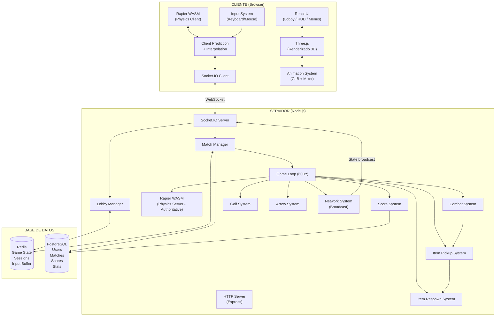

### 13.3 Diagrama de Estados — Match

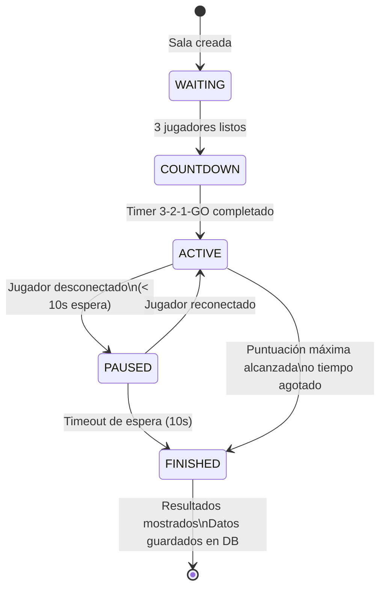

---

## 14. Diagramas de Secuencia

### 14.1 Flujo de creación y conexión de sala

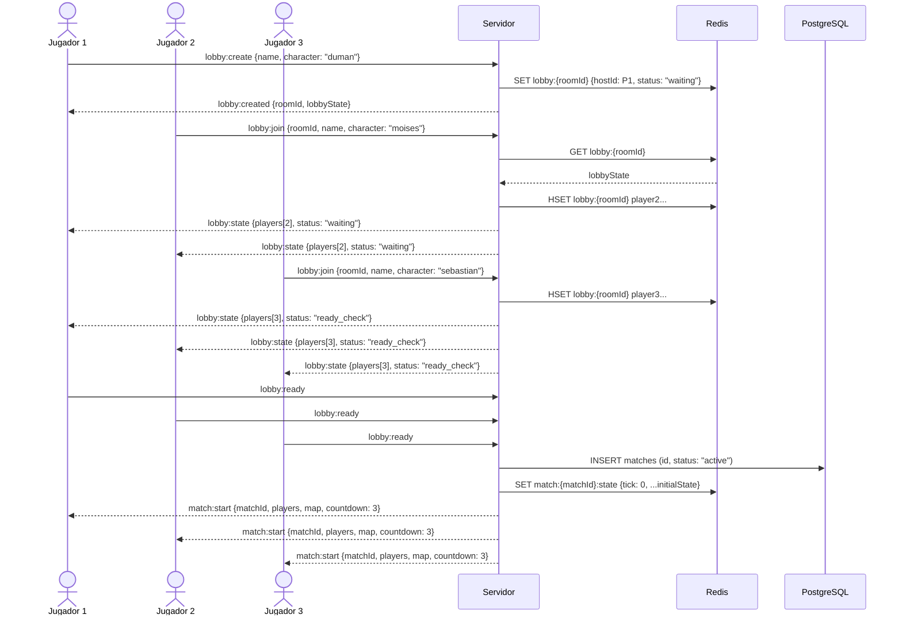

### 14.2 Flujo de golpe de golf (Server-Authoritative)

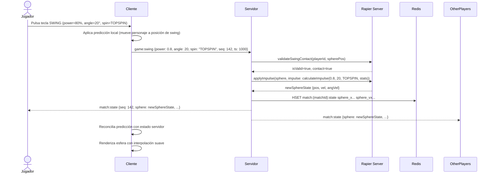

### 14.3 Flujo de puntuación con dwell timer (Core scored)

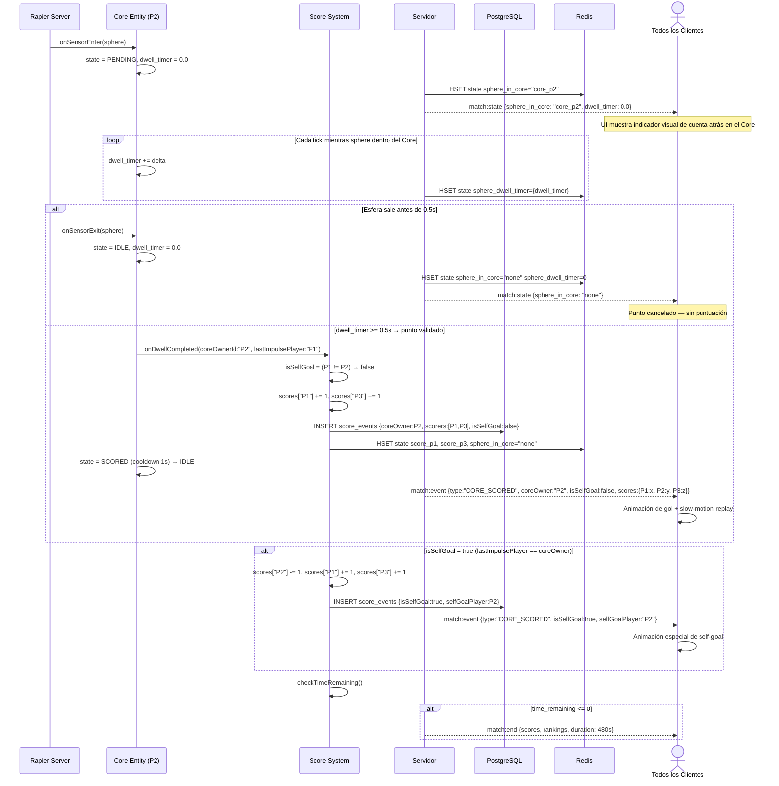

### 14.4 Flujo de acción de combate (Push)

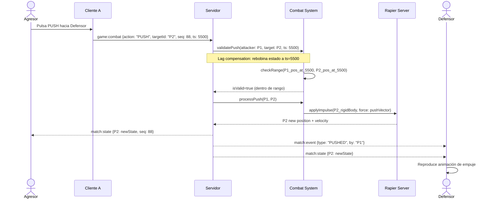

### 14.5 Flujo de recogida de item (Pickup)

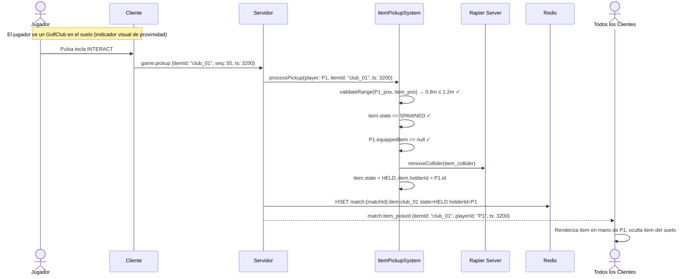

### 14.6 Flujo de desarme (Disarm)

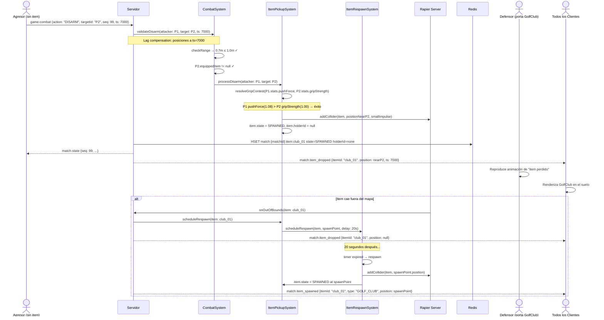

### 14.7 Flujo de robo de item (Steal)

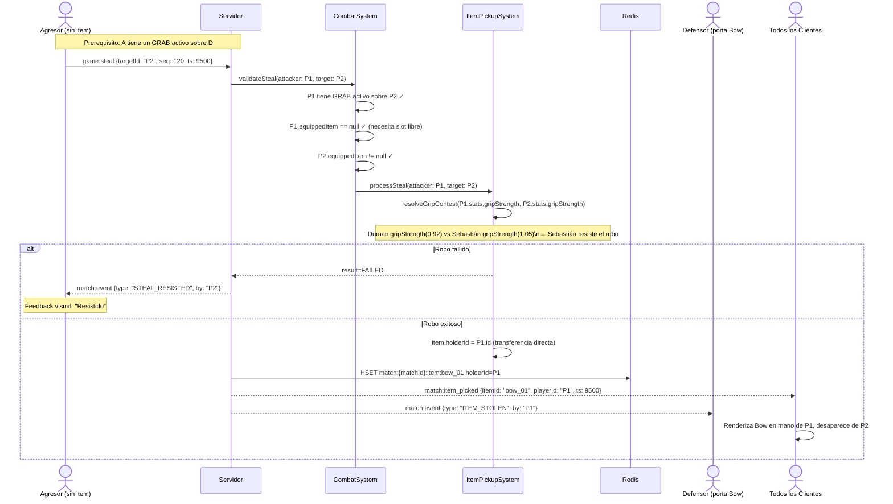

---

## 15. Escalabilidad

### 15.1 Escalabilidad vertical (corto plazo)

Un único servidor Node.js puede manejar cómodamente 10-20 partidas simultáneas (30-60 conexiones WebSocket) con el game loop a 60Hz. Para el alcance inicial del proyecto (3 amigos jugando), esta arquitectura es más que suficiente.

### 15.2 Escalabilidad horizontal (largo plazo)

Si el juego crece y requiere múltiples servidores:

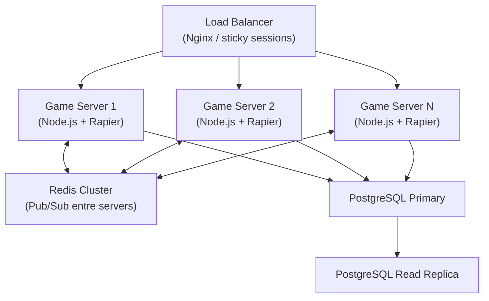

Socket.IO tiene soporte nativo de Redis Adapter para broadcasting cross-server. La migración a horizontal scaling no requiere cambios en la lógica del juego.

### 15.3 Presupuesto de performance estimado (por partida)

| Recurso | Estimado |
|---------|---------|
| CPU servidor (1 partida, 60Hz) | ~5% de 1 core |
| RAM servidor (1 partida) | ~50 MB (Rapier + estado) |
| Ancho de banda (1 partida, 20Hz broadcast) | ~15 KB/s por cliente |
| Redis keys por partida | ~20 keys activas |
| PostgreSQL writes por partida | ~50-200 rows (score events) |

---

## 16. Plan de Fases

| Fase | Objetivo | Sistemas Involucrados | Criterio de Aceptación |
|------|---------|----------------------|----------------------|
| 1 | Arquitectura y planificación | — | Documento aprobado por el equipo |
| 2 | Lobby + sala + 3 conexiones | NetworkSystem, LobbyManager, Socket.IO | 3 navegadores conectados a la misma sala |
| 3 | Movimiento + cámara + sync | Player, PhysicsSystem, AnimationSystem | 3 personajes moviéndose sincronizados |
| 4 | Esfera + física + puntuación | Sphere, Core, ScoreSystem | La esfera rebota y puntúa correctamente |
| 5 | Golf | GolfClub, GolfSystem | Mecánica de potencia/ángulo/efecto funcional |
| 6 | Lucha | CombatSystem | Push/Block/Grab/Disarm funcionan |
| 7 | Arco | Bow, Arrow, ArrowSystem | Flechas con trayectoria balística afectan esfera |
| 8 | Balance | character_stats, métricas | Win rates por personaje dentro de ±5% |
| 9 | Optimización | Todo | 60fps en hardware de referencia, <150ms latencia |

---

## Apéndice — Estado de decisiones de diseño

### ✅ Resueltas (no requieren más discusión)

| # | Decisión | Valor confirmado |
|---|----------|-----------------|
| 1 | Duración de partida | 8 minutos |
| 2 | Condición de victoria | Más puntos al terminar el tiempo |
| 3 | Puntos por Core | +1 para cada rival |
| 4 | Self-goal | -1 para el provocador, +1 para los dos rivales igualmente |
| 5 | Validación de Core | Dwell timer de 0.5 segundos continuos |
| 6 | Flechas afectan jugadores | Sí, pequeño empuje sin daño |
| 7 | Obstáculos en MVP | No — mapa limpio en la primera versión |
| 8 | Mapa | Circular, radio 20m, 3 Cores en triángulo a 10m del centro |
| 9 | Items en el mapa | 2 GolfClub + 2 Bow en spawn points fijos simétricos |
| 10 | GolfClub y Bow | Objetos físicos del mundo, no equipamiento inicial |

### ⏳ Pendientes (a resolver antes de las fases indicadas)

| # | Pregunta | Fase que la necesita |
|---|----------|---------------------|
| 1 | **Animaciones de Moises** — ¿Quién las crea? ¿Retarget Mixamo o animador? | Fase 3 (movimiento) |
| 2 | **Reducción de Sebastian.glb** — 13MB es excesivo. ¿Draco compression o reducción de polígonos? | Fase 3 (carga de assets) |
| 3 | **Número de flechas por recarga del Bow** — actualmente 3 en el aire, pero ¿cuántas tiene el quiver? | Fase 6 (arco) |
| 4 | **Duración del GRAB y mecánica de escape** — ¿Tecla de mashing? ¿Dirección opuesta? | Fase 5 (lucha) |
| 5 | **Cooldown de BLOCK** — definido en 3s pero no testeado | Fase 7 (balance) |
| 6 | **¿Empate al terminar el tiempo?** — en MVP no hay muerte súbita, ¿es aceptable? | Fase 4 (puntuación) |

---

*Documento v1.2 — Arquitectura aprobada y decisiones de diseño confirmadas. Listo para iniciar Fase 2.*
